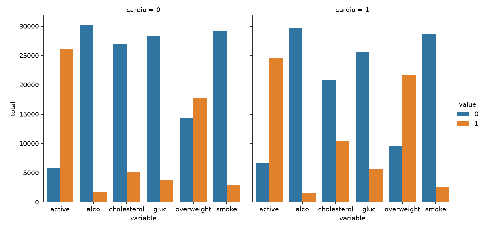
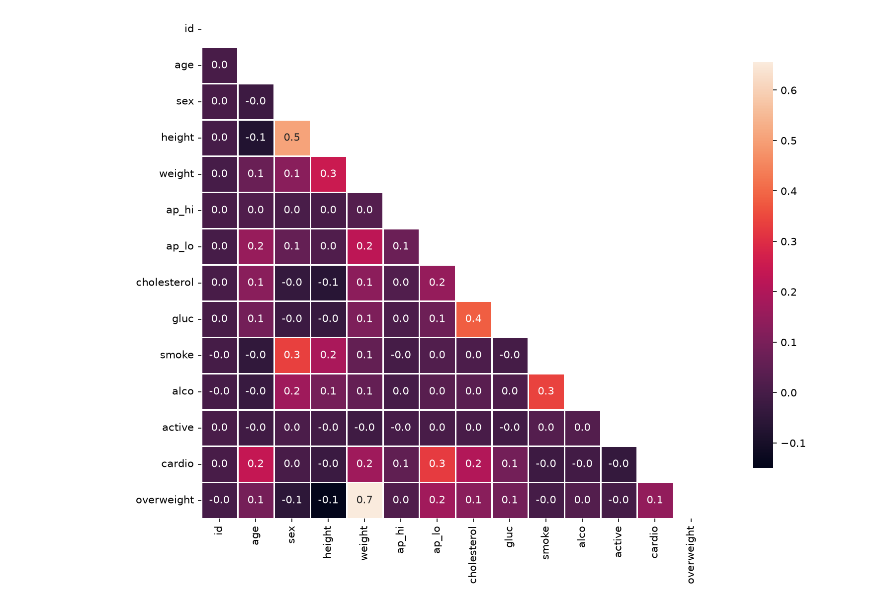

# Medical Data Visualizer

https://www.freecodecamp.org/learn/data-analysis-with-python/data-analysis-with-python-projects/medical-data-visualizer

## Objectif

Visualiser et calculer des statistiques à partir de données d'examen médical en utilisant
matplotlib, seaborn et pandas.

## Tâches

### 1. Graphique catégoriel (`draw_cat_plot`)

Créer un graphique montrant les comptages des résultats bons/mauvais pour les variables
`cholesterol`, `gluc`, `alco`, `active`, et `smoke` pour les patients avec `cardio=1` et
`cardio=0` dans des panneaux différents.

Le graphique doit ressembler à `examples/Figure_1.png`.

### 2. Matrice de corrélation (`draw_heat_map`)

Créer une matrice de corrélation en utilisant `seaborn.heatmap()`. Masquer le triangle
supérieur.

Le graphique doit ressembler à `examples/Figure_2.png`.

## Données

Le fichier `medical_examination.csv` est inclus dans le boilerplate.

Colonnes importantes :
- `cardio` : cible (0 = pas de maladie cardiaque, 1 = maladie cardiaque)
- `cholesterol`, `gluc` : cholestérol, glucose
- `alco`, `active`, `smoke` : habitudes de vie
- `ap_hi`, `ap_lo` : pression artérielle
- `height`, `weight`, `sex` (la colonne s'appelle `sex`, pas `gender`)

## Nettoyage des données

Avant de créer les visualisations, appliquer les filtres suivants :
- `ap_lo` ≤ `ap_hi` (pression diastolique ≤ systolique)
- `height` entre le 2.5ᵉ et le 97.5ᵉ percentile
- `weight` entre le 2.5ᵉ et le 97.5ᵉ percentile

## Lancement

```bash
uv run medical_data_visualizer.py       # produit les deux figures
uv run test_units.py                    # tests unitaires
uv run --with marimo marimo edit --sandbox notebook.py
```

Depuis la racine de la certification :

```bash
make test CERTIF=data-analysis-with-python PROJET=03-medical-data-visualizer
```

Le script télécharge `medical_examination.csv` au premier lancement
(`data/raw/` est gitignoré) et écrit les figures dans `figures/`.

## Fichiers

| Fichier | Rôle |
|---|---|
| `medical_data_visualizer.py` | `draw_cat_plot()` et `draw_heat_map()`, plus la chaîne de préparation |
| `test_units.py` | Tests unitaires, dont les 4 assertions du corrigé officiel |
| `notebook.py` | Notebook Marimo : exploration et figures commentées |
| `docs/enonce-freecodecamp.md` | Énoncé officiel, cahier des charges imposé |
| `docs/notions-mobilisees.md` | Les notions travaillées, expliquées |
| `data/raw/` | Jeu de données brut, non versionné : créé et rempli au premier lancement |

## Le piège du projet : trois exigences absentes de l'énoncé

`test_module.py` impose des contraintes que les instructions ne mentionnent pas.

**Les fonctions s'appellent sans argument.** Le correcteur fait
`draw_cat_plot()` : les deux fonctions doivent charger et préparer les données
elles-mêmes. Une signature `draw_cat_plot(df)` lève un `TypeError` avant toute
vérification.

**`overweight` fait partie du graphe catégoriel.** L'énoncé énumère
`cholesterol`, `gluc`, `alco`, `active` et `smoke`, mais le correcteur attend
six barres par panneau, `overweight` compris, et vérifie l'ordre alphabétique
des étiquettes.

**Les axes portent des noms précis** : `variable` en abscisse, `total` en
ordonnée. Un `kind="count"` place les valeurs 0/1 en abscisse et intitule
l'ordonnée `count` : il faut agréger explicitement avant de tracer en
`kind="bar"`.

## L'autre piège : l'ordre des filtres de nettoyage

Les quatre bornes de percentile doivent être calculées sur le **jeu complet**,
puis appliquées en une seule passe.

Filtrer séquentiellement, en recalculant les quantiles après chaque étape,
paraît équivalent mais ne l'est pas : chaque filtre rétrécit la distribution,
donc resserre les bornes suivantes. Le jeu tombe à 62 784 lignes au lieu de
63 259, et trois corrélations de la heatmap changent au dixième près, ce qui
suffit à faire échouer `test_heat_map_values`.

## Figures produites

Versionnées : le livrable de ce projet **est** un graphique, le consulter ne
devrait pas exiger de relancer le pipeline.

### Graphique catégoriel



Six variables, deux panneaux (`cardio=0` et `cardio=1`), treize barres au total.
La lecture qui compte : `cholesterol` et `overweight` basculent nettement entre
les deux panneaux, `alco` et `smoke` beaucoup moins.

### Matrice de corrélation



Triangle supérieur masqué pour ne pas lire deux fois la même information. Les
91 valeurs annotées sont celles que le correcteur vérifie une à une.

## État : conforme au corrigé officiel

Les 4 assertions de `test_module.py` passent : étiquettes du graphe catégoriel,
13 barres, étiquettes de la heatmap, et les 91 valeurs de corrélation à
l'identique. 25 tests unitaires.

URL de soumission : *à compléter une fois le projet soumis.*
