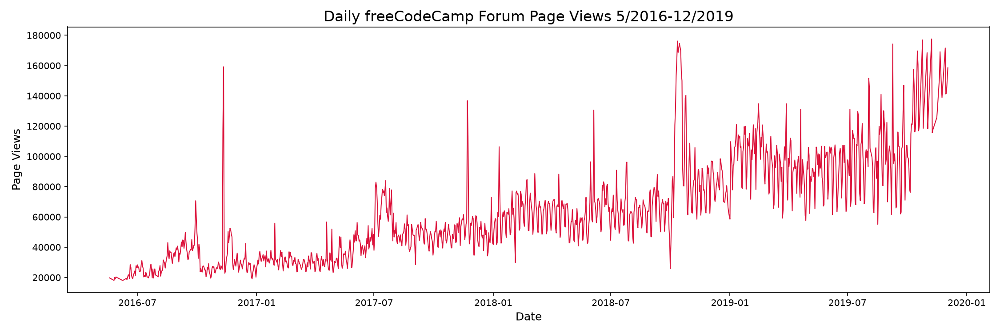
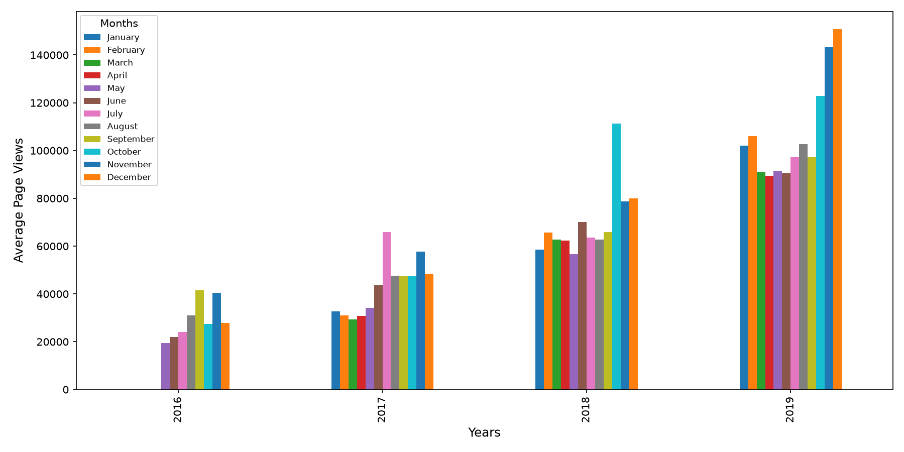
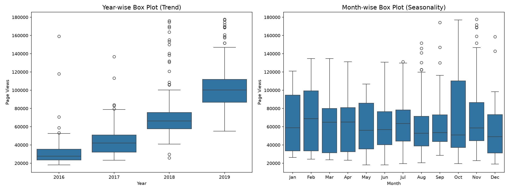

# Page View Time Series Visualizer

https://www.freecodecamp.org/learn/data-analysis-with-python/data-analysis-with-python-projects/page-view-time-series-visualizer

## Objectif

Visualiser les vues quotidiennes du forum freeCodeCamp en utilisant des graphiques line,
bar et box pour analyser la saisonnalité et les tendances.

## Tâches

### 1. Graphique linéaire (`draw_line_plot`)

- Titre : `Daily freeCodeCamp Forum Page Views 5/2016-12/2019`
- Axe X : `Date`
- Axe Y : `Page Views`
- Similaire à `examples/Figure_1.png`

### 2. Graphique en barres (`draw_bar_plot`)

- Moyenne quotidienne des vues par mois groupés par année
- Légende avec labels de mois, titre : `Months`
- Axe X : `Years`
- Axe Y : `Average Page Views`
- Similaire à `examples/Figure_2.png`

### 3. Box plots (`draw_box_plot`)

Deux box plots adjacents :
- **Gauche** : Distribution par année (tendance)
  - Titre : `Year-wise Box Plot (Trend)`
- **Droite** : Distribution par mois (saisonnalité)
  - Titre : `Month-wise Box Plot (Seasonality)`
- Mois en bas commençant par `Jan`
- Similaire à `examples/Figure_3.png`

## Données

Le fichier `fcc-forum-pageviews.csv` est inclus dans le boilerplate.

Colonnes :
- `date` : date de la mesure
- `value` : nombre de vues quotidiennes

La colonne s'appelle **`value`**, pas `views` : c'est le nom du fichier
distribué par freeCodeCamp, alors que l'énoncé parle de « page views » pour
désigner la grandeur mesurée.

## Nettoyage des données

Avant de créer les visualisations, filtrer les valeurs extrêmes :
- Supprimer les 2.5% les plus bas
- Supprimer les 2.5% les plus hauts

## Lancement

```bash
uv run time_series_visualizer.py        # produit les trois figures
uv run test_units.py                    # tests unitaires
uv run --with marimo marimo edit --sandbox notebook.py
```

Depuis la racine de la certification :

```bash
make test CERTIF=data-analysis-with-python PROJET=04-page-view-time-series-visualizer
```

## Fichiers

| Fichier | Rôle |
|---|---|
| `time_series_visualizer.py` | `df` au niveau module, plus les trois fonctions de tracé |
| `test_units.py` | Tests unitaires, dont les 11 assertions du corrigé officiel |
| `notebook.py` | Notebook Marimo : exploration et figures commentées |
| `docs/enonce-freecodecamp.md` | Énoncé officiel, cahier des charges imposé |
| `docs/notions-mobilisees.md` | Les notions travaillées, expliquées |
| `data/raw/` | Jeu de données brut, non versionné : créé et rempli au premier lancement |

## Le piège du projet : le contrat avec le correcteur

Trois exigences ne figurent pas dans l'énoncé et font échouer la soumission.

**Le module expose un `df`.** La première assertion lit
`time_series_visualizer.df.count(numeric_only=True)` sans passer par une
fonction : le DataFrame nettoyé doit exister à l'import, pas seulement à
l'intérieur de `load_data()`.

**Les trois fonctions s'appellent sans argument.** `draw_line_plot()`,
`draw_bar_plot()`, `draw_box_plot()` : une signature exigeant un `df` lève un
`TypeError` avant toute vérification.

**Les mois portent deux formes selon le graphique.** La légende du bar plot
attend les noms complets (`January`…`December`), les étiquettes du box plot
mensuel les abréviations (`Jan`…`Dec`). Utiliser la même liste partout fait
échouer l'un ou l'autre.

## L'autre piège : la colonne s'appelle `value`

L'énoncé parle de « page views » et les tutoriels nomment volontiers la colonne
`views`, mais le fichier distribué par freeCodeCamp porte l'en-tête
`date,value`. Un code écrit sur le nom `views` lève un `KeyError` au premier
accès.

## Figures produites

Versionnées : le livrable de ce projet **est** un graphique.

### Évolution quotidienne



1238 points après filtrage des 2,5 % extrêmes de chaque côté.

### Moyennes mensuelles par année



La croissance d'une année sur l'autre est le signal dominant ; 2016 n'a que
huit mois, le jeu commençant en mai.

### Tendance et saisonnalité



Le panneau de gauche montre la tendance, celui de droite la saisonnalité. Les
deux répondent à des questions différentes sur les mêmes données.

## État : conforme au corrigé officiel

Les 11 assertions de `test_module.py` passent : 1238 lignes après filtrage,
titres et étiquettes des trois figures, 49 barres, 4 et 12 boîtes.
24 tests unitaires.

URL de soumission : *à compléter une fois le projet soumis.*
