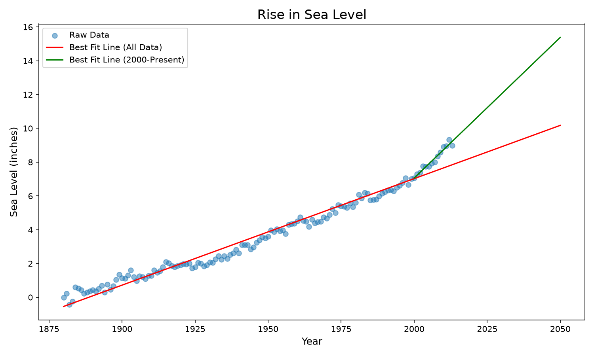

# Sea Level Predictor

https://www.freecodecamp.org/learn/data-analysis-with-python/data-analysis-with-python-projects/sea-level-predictor

## Objectif

Analyser un jeu de données de variation du niveau de la mer depuis 1880 et prédire
l'élévation jusqu'à l'année 2050.

## Tâches

### 1. Scatter plot des données

- Utiliser Pandas pour importer `epa-sea-level.csv`
- Axe X : `Year`
- Axe Y : `CSIRO Adjusted Sea Level`

### 2. Ligne de tendance (toutes les données)

- Utiliser `scipy.stats.linregress` pour calculer la pente et l'ordonnée à l'origine
- Tracer la ligne de tendance de 1880 à 2050
- Prédire le niveau de la mer en 2050

### 3. Ligne de tendance (depuis 2000)

- Créer une nouvelle ligne de tendance uniquement avec les données de 2000 à aujourd'hui
- Tracer cette ligne jusqu'à 2050
- Prédire le niveau de la mer en 2050 si le taux actuel continue

### Labels

- Axe X : `Year`
- Axe Y : `Sea Level (inches)`
- Titre : `Rise in Sea Level`

## Données

Le fichier `epa-sea-level.csv` est inclus dans le boilerplate.

Colonnes :
- `Year` : année de la mesure
- `CSIRO Adjusted Sea Level` : niveau de la mer ajusté (en pouces)

## Lancement

```bash
uv run sea_level_predictor.py           # produit la figure et les prédictions
uv run test_units.py                    # tests unitaires
uv run --with marimo marimo edit --sandbox notebook.py
```

Depuis la racine de la certification :

```bash
make test CERTIF=data-analysis-with-python PROJET=05-sea-level-predictor
```

## Fichiers

| Fichier | Rôle |
|---|---|
| `sea_level_predictor.py` | `draw_plot()` : nuage de points et deux droites de régression |
| `test_units.py` | Tests unitaires, dont les assertions du corrigé officiel |
| `notebook.py` | Notebook Marimo : exploration et figure commentée |
| `docs/enonce-freecodecamp.md` | Énoncé officiel, cahier des charges imposé |
| `docs/notions-mobilisees.md` | Les notions travaillées, expliquées |
| `data/raw/` | Jeu de données brut, non versionné : créé et rempli au premier lancement |

## Le piège du projet : `draw_plot()` renvoie un `Axes`

C'est la divergence à retenir de cette certification. Le correcteur écrit :

```python
self.ax = sea_level_predictor.draw_plot()
```

puis lit directement `ax.get_title()`, `ax.get_lines()`, `ax.get_xticks()`.
Renvoyer une `Figure`, comme le font les projets 03 et 04 de la même
certification, fait échouer toutes les assertions.

La fonction s'appelle par ailleurs **sans argument** : elle charge les données
elle-même.

## Ce que les données ne disent pas

Deux propriétés du fichier surprennent à la lecture.

**Le niveau de la mer est négatif avant 1884.** La colonne mesure un *écart* à
une référence, pas une hauteur absolue : minimum −0,44 pouce en 1882. Un test
qui vérifierait la positivité échouerait à juste titre.

**113 valeurs manquantes**, toutes dans `NOAA Adjusted Sea Level` : cette série
ne commence qu'en 1993. La colonne utilisée par le projet,
`CSIRO Adjusted Sea Level`, est complète sur les 134 années.

## Figure produite

Versionnée : le livrable de ce projet **est** un graphique.



Les 134 observations depuis 1880, avec deux droites de tendance prolongées
jusqu'en 2050 : l'une ajustée sur toutes les données (10,18 pouces prédits),
l'autre sur les seules données depuis 2000 (15,38 pouces). L'écart entre les
deux pentes est le résultat intéressant du projet : 0,063 pouce/an sur le
siècle contre 0,166 depuis 2000, soit une accélération d'un facteur 2,6.

## État : conforme au corrigé officiel

Les assertions de `test_module.py` passent : titre, étiquettes, dix graduations
de 1850 à 2075, les 134 points du nuage, et les deux droites de régression
vérifiées à la 7ᵉ décimale (171 points de 1880 à 2050, 51 points de 2000 à
2050). 23 tests unitaires.

URL de soumission : *à compléter une fois le projet soumis.*
